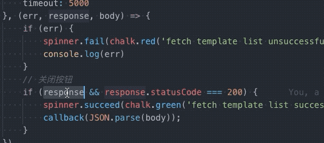
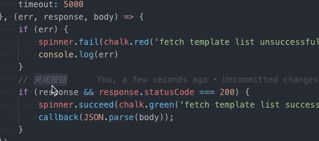
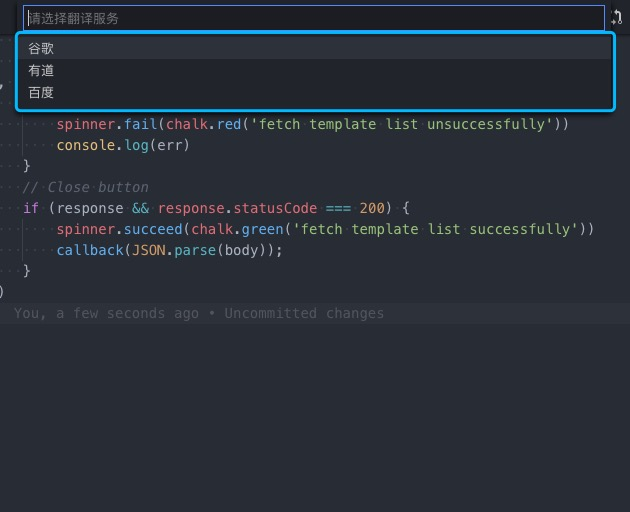

# wizard-translate

## 特点

* 滑词翻译
* 翻译语言自动检测
* 多个翻译服务商支持
* 支持驼峰命名单词翻译
* 翻译替换

## 演示

* 滑词翻译



* 翻译替换



## 使用

* 翻译替换 `ctrl + alt + r`（mac: `ctrl + cmd  + r`）

```js
// 关闭按钮
=> close button
```

* 翻译替换成驼峰 `ctrl + alt + shift + r` （mac: `ctrl + cmd + shift + r`）(只支持中文翻译成英文)

```js
// 关闭按钮
=> closeButton
```

## 设置

`ctrl + alt + p` （mac: `cmd + shift + p`） 输入 wizardTranslate 可以切换翻译服务商 google, 有道, 百度



## 待开发

* 鼠标移入翻译
* 添加翻译webview